# Comprehensive Guide to Mermaid Diagrams

This document provides examples and usage instructions for all types of diagrams supported by Mermaid version 11.6.0.

## Table of Contents

1. [Flowchart](#flowchart)
2. [Sequence Diagram](#sequence-diagram)
3. [Class Diagram](#class-diagram)
4. [State Diagram](#state-diagram)
5. [Entity Relationship Diagram](#entity-relationship-diagram)
6. [User Journey](#user-journey)
7. [Gantt Chart](#gantt-chart)
8. [Pie Chart](#pie-chart)
9. [Git Graph](#git-graph)
10. [C4 Diagram](#c4-diagram)
11. [Mindmap](#mindmap)
12. [Timeline](#timeline)

## Flowchart

### Basic Flowchart

Flowcharts can be drawn in different directions: TB (top to bottom), BT (bottom to top), RL (right to left), and LR (left to right).

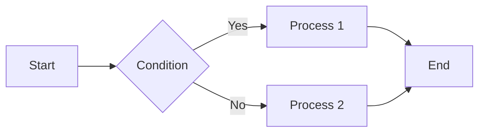

### Usage

```
flowchart LR
    A[Start] --> B{Condition}
    B -->|Yes| C[Process 1]
    B -->|No| D[Process 2]
    C --> E[End]
    D --> E
```

### Various Node Shapes

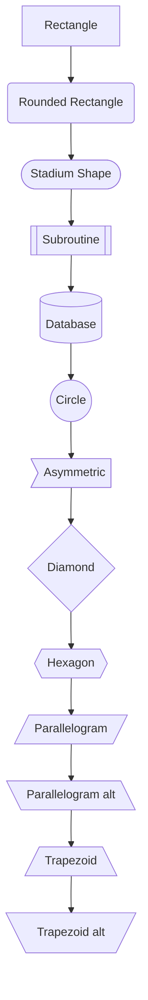

### Usage

```
flowchart TD
    A[Rectangle] --> B(Rounded Rectangle)
    B --> C([Stadium Shape])
    C --> D[[Subroutine]]
    D --> E[(Database)]
    E --> F((Circle))
    F --> G>Asymmetric]
    G --> H{Diamond}
    H --> I{{Hexagon}}
    I --> J[/Parallelogram/]
    J --> K[\Parallelogram alt\]
    K --> L[/Trapezoid\]
    L --> M[\Trapezoid alt/]
```

### Subgraphs

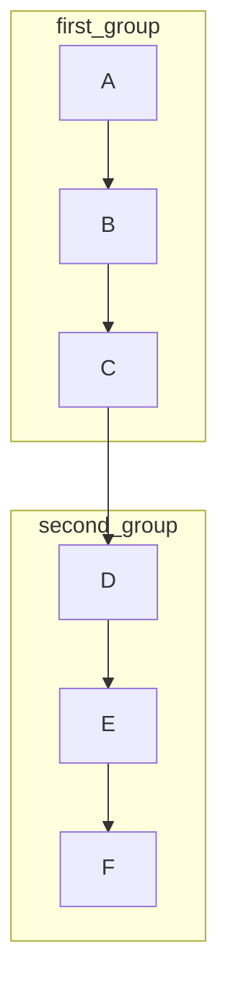

### Usage

```
flowchart TB
    subgraph first_group
    A[A] --> B[B]
    B --> C[C]
    end
    subgraph second_group
    D[D] --> E[E]
    E --> F[F]
    end
    C --> D
```

## Sequence Diagram

### Basic Sequence Diagram

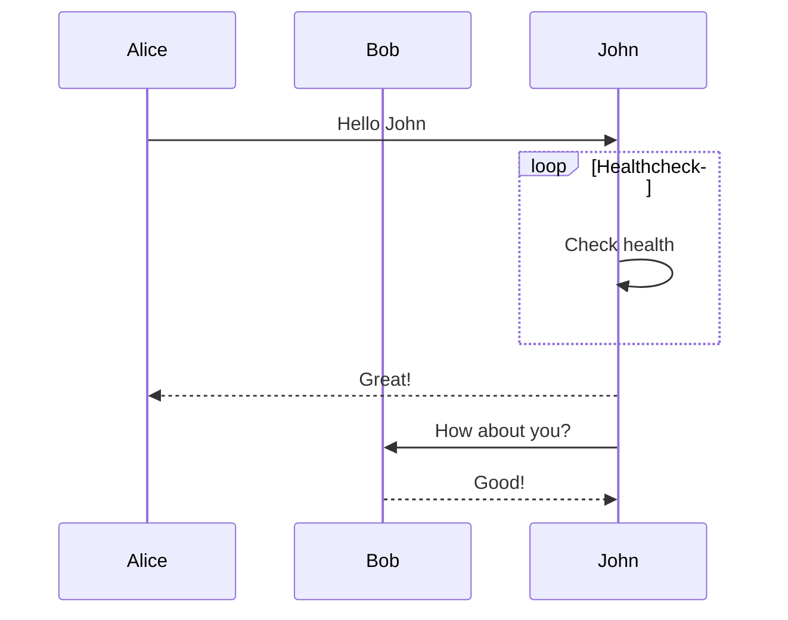

### Usage

```
sequenceDiagram
    participant Alice
    participant Bob
    Alice->>John: Hello John
    loop Healthcheck
        John->>John: Check health
    end
    John-->>Alice: Great!
    John->>Bob: How about you?
    Bob-->>John: Good!
```

### Message Types

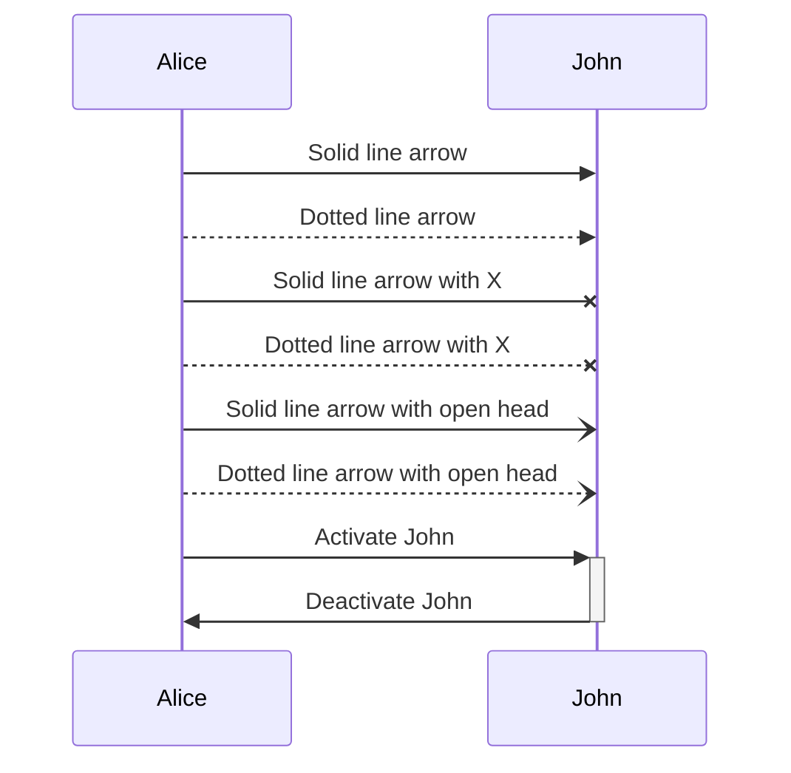

### Usage

```
sequenceDiagram
    participant A as Alice
    participant J as John
    A->>J: Solid line arrow
    A-->>J: Dotted line arrow
    A-xJ: Solid line arrow with X
    A--xJ: Dotted line arrow with X
    A-)J: Solid line arrow with open head
    A--)J: Dotted line arrow with open head
    A->>+J: Activate John
    J->>-A: Deactivate John
```

### Notes and Alternative Paths

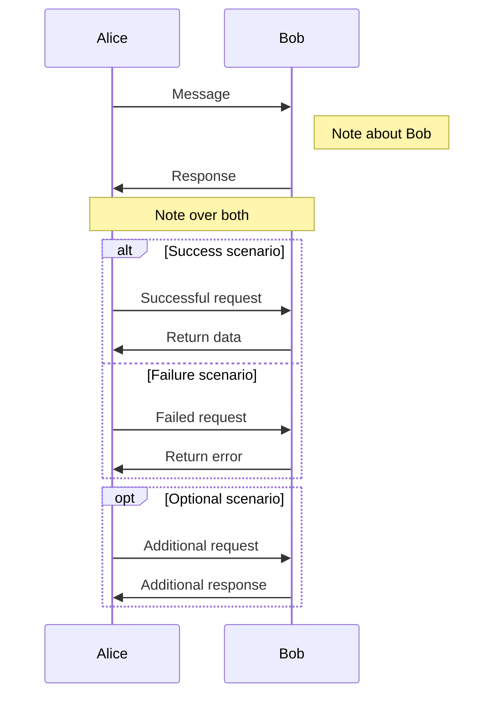

### Usage

```
sequenceDiagram
    participant A as Alice
    participant B as Bob
    A->>B: Message
    Note right of B: Note about Bob
    B->>A: Response
    Note over A,B: Note over both

    alt Success scenario
        A->>B: Successful request
        B->>A: Return data
    else Failure scenario
        A->>B: Failed request
        B->>A: Return error
    end

    opt Optional scenario
        A->>B: Additional request
        B->>A: Additional response
    end
```

## Class Diagram

### Basic Class Diagram

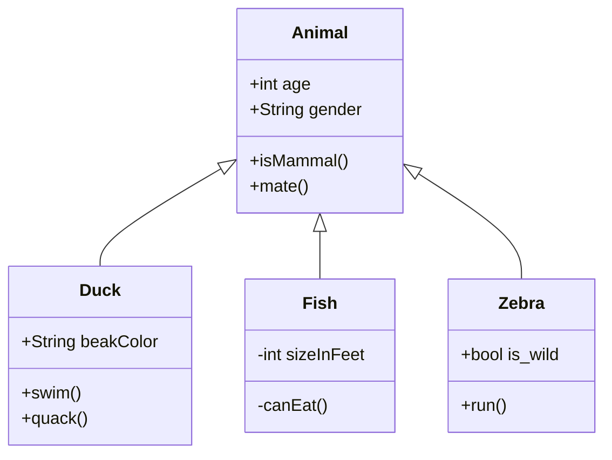

### Usage

```
classDiagram
    Animal <|-- Duck
    Animal <|-- Fish
    Animal <|-- Zebra

    Animal : +int age
    Animal : +String gender
    Animal : +isMammal()
    Animal : +mate()

    class Duck{
        +String beakColor
        +swim()
        +quack()
    }

    class Fish{
        -int sizeInFeet
        -canEat()
    }

    class Zebra{
        +bool is_wild
        +run()
    }
```

### Relationship Types

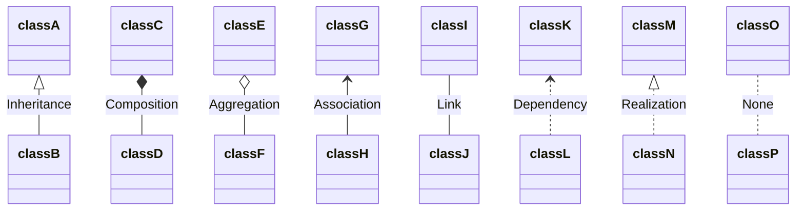

### Usage

```
classDiagram
    classA <|-- classB : Inheritance
    classC *-- classD : Composition
    classE o-- classF : Aggregation
    classG <-- classH : Association
    classI -- classJ : Link
    classK <.. classL : Dependency
    classM <|.. classN : Realization
    classO .. classP : None
```

## State Diagram

### Basic State Diagram

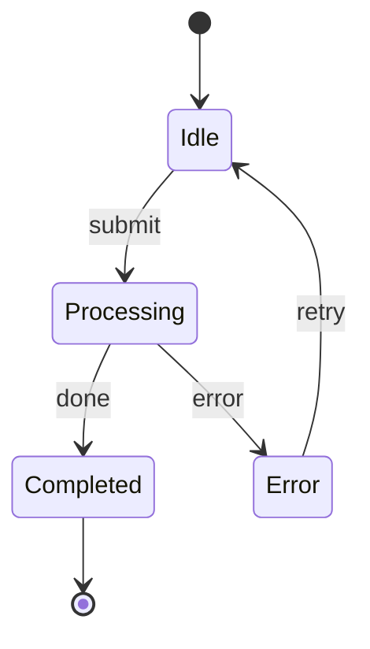

### Usage

```
stateDiagram-v2
    [*] --> Idle
    Idle --> Processing : submit
    Processing --> Completed : done
    Processing --> Error : error
    Error --> Idle : retry
    Completed --> [*]
```

### Composite States

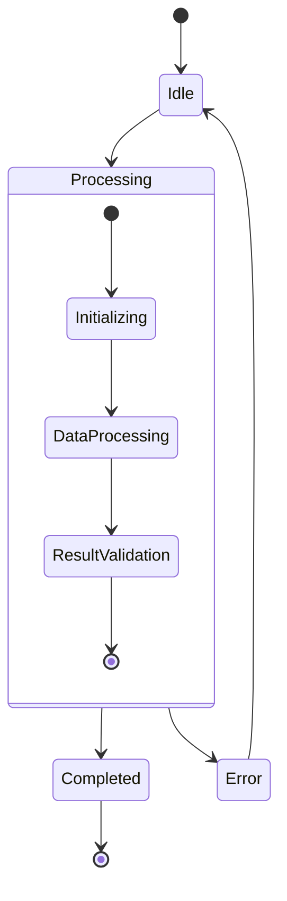

### Usage

```
stateDiagram-v2
    [*] --> Idle
    Idle --> Processing

    state Processing {
        [*] --> Initializing
        Initializing --> DataProcessing
        DataProcessing --> ResultValidation
        ResultValidation --> [*]
    }

    Processing --> Completed
    Processing --> Error
    Completed --> [*]
    Error --> Idle
```

### Concurrent States

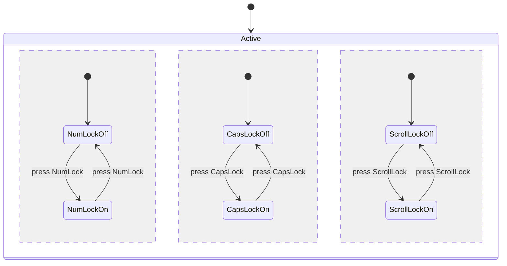

### Usage

```
stateDiagram-v2
    [*] --> Active

    state Active {
        [*] --> NumLockOff
        NumLockOff --> NumLockOn : press NumLock
        NumLockOn --> NumLockOff : press NumLock

        --
        [*] --> CapsLockOff
        CapsLockOff --> CapsLockOn : press CapsLock
        CapsLockOn --> CapsLockOff : press CapsLock

        --
        [*] --> ScrollLockOff
        ScrollLockOff --> ScrollLockOn : press ScrollLock
        ScrollLockOn --> ScrollLockOff : press ScrollLock
    }
```

## Entity Relationship Diagram

### Basic ER Diagram

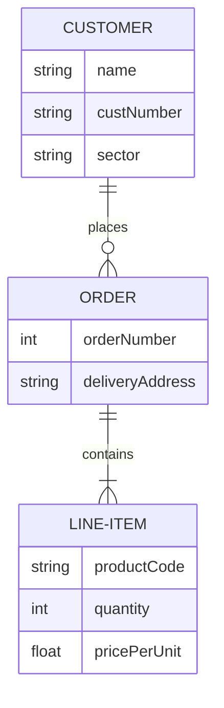

### Usage

```
erDiagram
    CUSTOMER ||--o{ ORDER : places
    CUSTOMER {
        string name
        string custNumber
        string sector
    }
    ORDER ||--|{ LINE-ITEM : contains
    ORDER {
        int orderNumber
        string deliveryAddress
    }
    LINE-ITEM {
        string productCode
        int quantity
        float pricePerUnit
    }
```

### Relationship Types

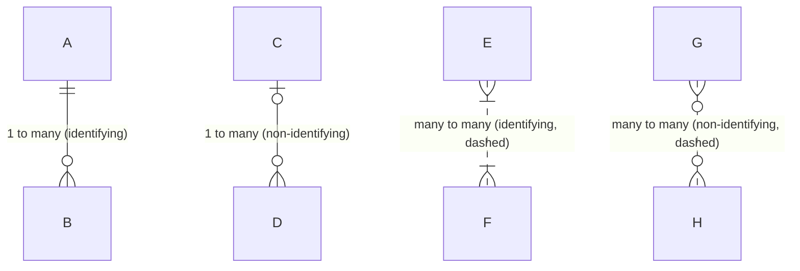

### Usage

```
erDiagram
    A ||--o{ B : "1 to many (identifying)"
    C |o--o{ D : "1 to many (non-identifying)"
    E }|..|{ F : "many to many (identifying, dashed)"
    G }o..o{ H : "many to many (non-identifying, dashed)"
```

## User Journey

### Basic User Journey

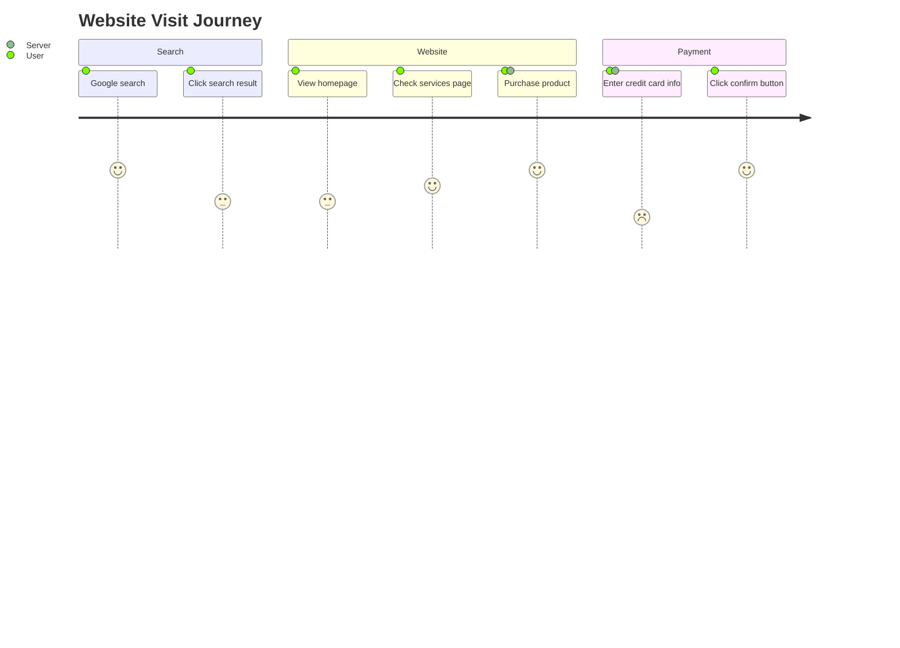

### Usage

```
journey
    title Website Visit Journey
    section Search
        Google search: 5: User
        Click search result: 3: User
    section Website
        View homepage: 3: User
        Check services page: 4: User
        Purchase product: 5: User, Server
    section Payment
        Enter credit card info: 2: User, Server
        Click confirm button: 5: User
```

## Gantt Chart

### Basic Gantt Chart

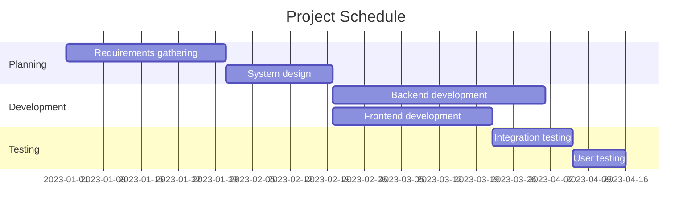

### Usage

```
gantt
    title Project Schedule
    dateFormat  YYYY-MM-DD
    section Planning
        Requirements gathering      :a1, 2023-01-01, 30d
        System design               :a2, after a1, 20d
    section Development
        Backend development         :a3, after a2, 40d
        Frontend development        :a4, after a2, 30d
    section Testing
        Integration testing         :a5, after a4, 15d
        User testing                :a6, after a5, 10d
```

### Adding Milestones

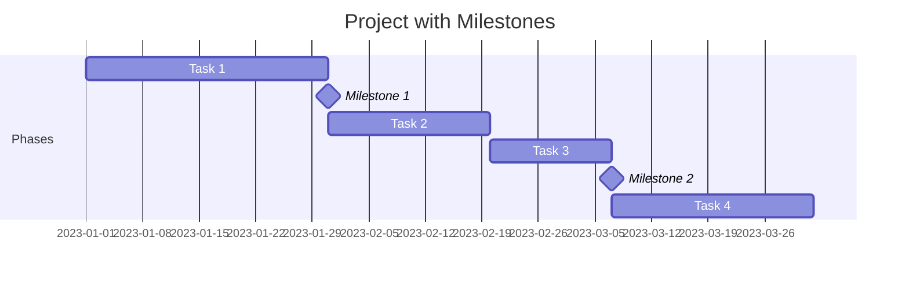

### Usage

```
gantt
    title Project with Milestones
    dateFormat  YYYY-MM-DD
    section Phases
        Task 1              :a1, 2023-01-01, 30d
        Milestone 1         :milestone, after a1, 0d
        Task 2              :a2, after a1, 20d
        Task 3              :a3, after a2, 15d
        Milestone 2         :milestone, after a3, 0d
        Task 4              :a4, after a3, 25d
```

## Pie Chart

### Basic Pie Chart

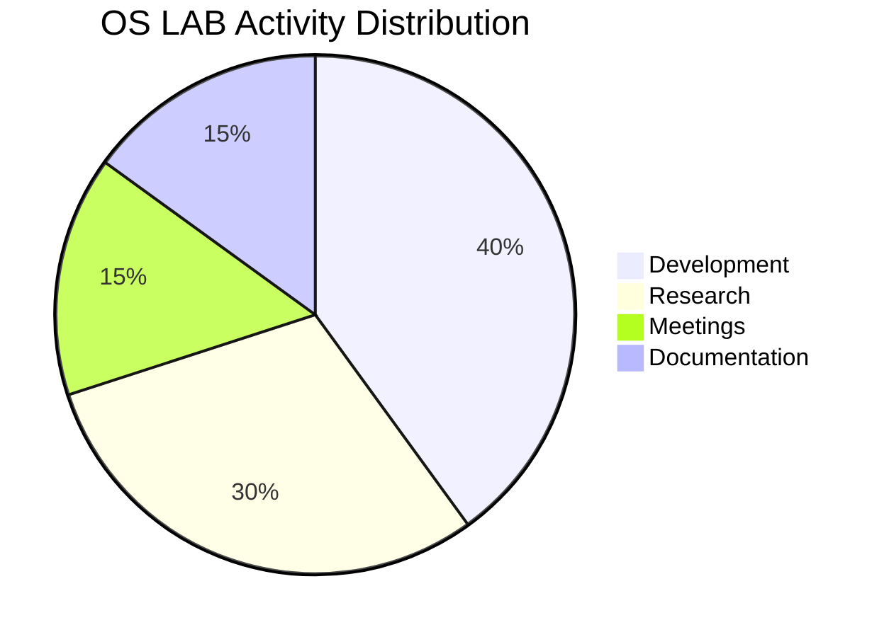

### Usage

```
pie title OS LAB Activity Distribution
    "Development" : 40
    "Research" : 30
    "Meetings" : 15
    "Documentation" : 15
```

## Git Graph

### Basic Git Graph

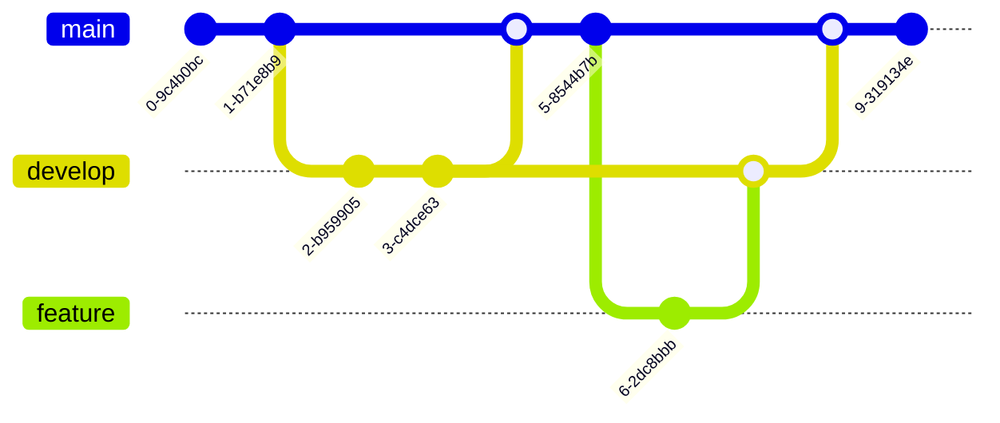

### Usage

```
gitGraph
    commit
    commit
    branch develop
    checkout develop
    commit
    commit
    checkout main
    merge develop
    commit
    branch feature
    checkout feature
    commit
    checkout develop
    merge feature
    checkout main
    merge develop
    commit
```

## C4 Diagram

### Context Diagram (C4 Level 1)

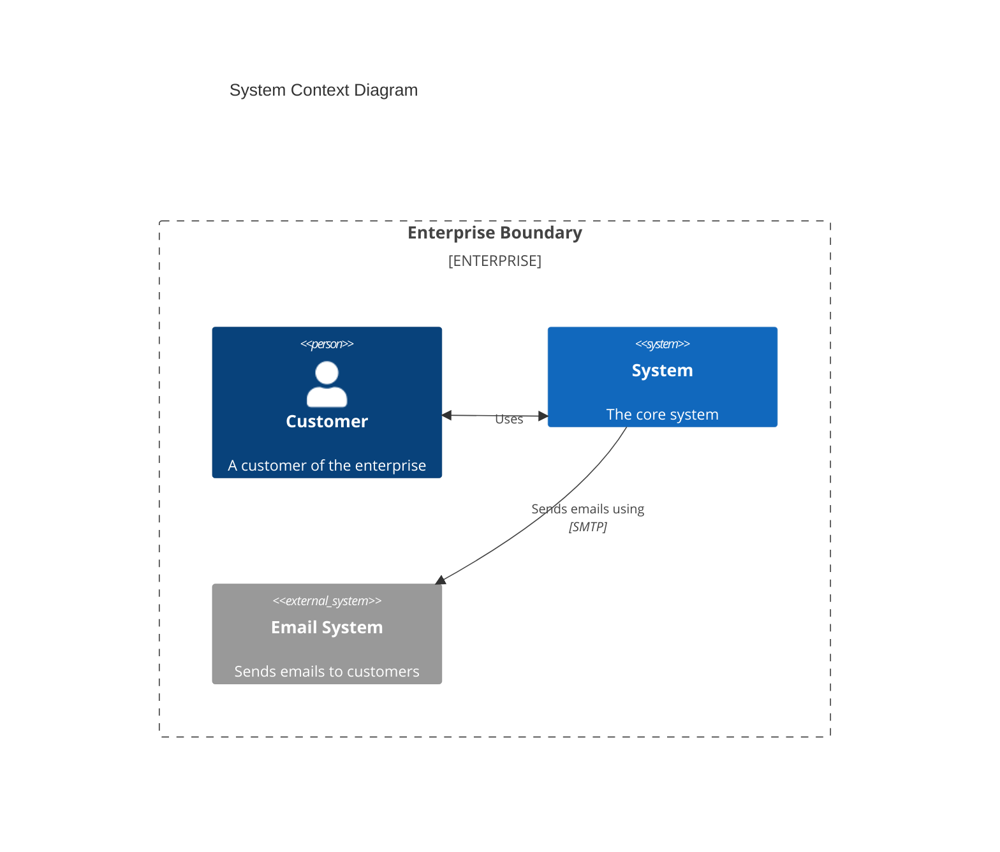

### Usage

```
C4Context
    title System Context Diagram
    Enterprise_Boundary(b0, "Enterprise Boundary") {
        Person(customer, "Customer", "A customer of the enterprise")

        System(system, "System", "The core system")

        System_Ext(email, "Email System", "Sends emails to customers")
    }

    BiRel(customer, system, "Uses")
    Rel(system, email, "Sends emails using", "SMTP")
```

## Mindmap

### Basic Mindmap

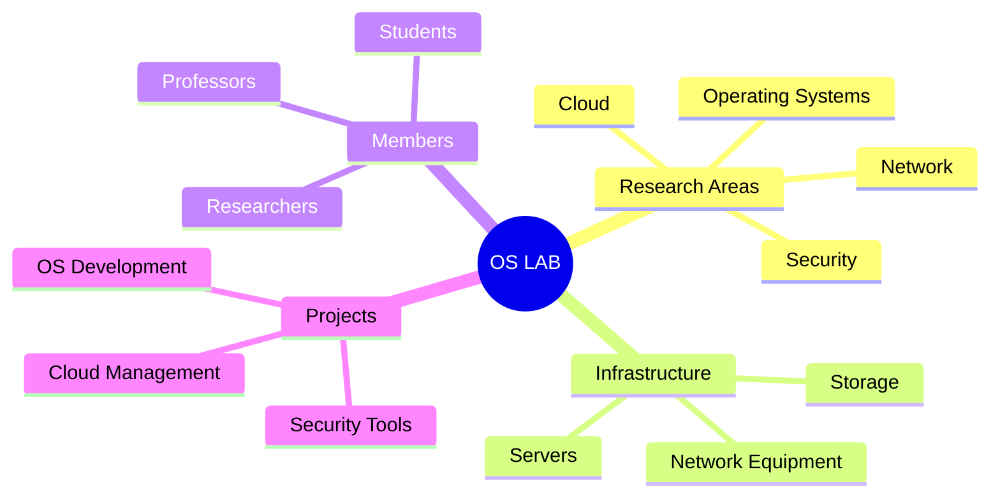

### Usage

```
mindmap
  root((OS LAB))
    Research Areas
      Operating Systems
      Network
      Security
      Cloud
    Infrastructure
      Servers
      Storage
      Network Equipment
    Members
      Professors
      Researchers
      Students
    Projects
      OS Development
      Cloud Management
      Security Tools
```

## Timeline

### Basic Timeline

```mermaid
timeline
    title History of OS LAB
    2018 : Lab established
         : First project started
    2019 : First paper published
    2020 : Remote research due to COVID-19
         : Cloud infrastructure built
    2021 : First international conference participation
    2022 : 5 new members joined
         : New server equipment acquired
    2023 : More than 10 projects ongoing
         : Website redesigned
```

### Usage

```
timeline
    title History of OS LAB
    2018 : Lab established
         : First project started
    2019 : First paper published
    2020 : Remote research due to COVID-19
         : Cloud infrastructure built
    2021 : First international conference participation
    2022 : 5 new members joined
         : New server equipment acquired
    2023 : More than 10 projects ongoing
         : Website redesigned
```

---

This document was created based on Mermaid version 11.6.0 and contains examples of all diagram types provided in the official documentation. Each example is presented with both the rendered result and the actual code for easy understanding and implementation.
