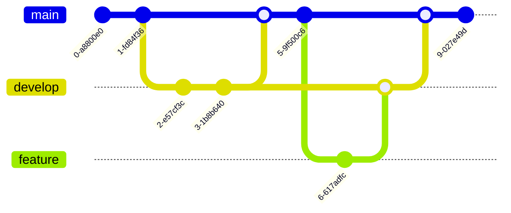

# Mermaid 다이어그램 종합 가이드

이 문서는 Mermaid 11.6.0 버전을 기준으로 모든 유형의 다이어그램 예제와 사용법을 제공합니다.

잠시 많은 내용을 렌더링 하느라 로딩이 좀 있을 수 있습니다

## 목차

- [Mermaid 다이어그램 종합 가이드](#mermaid-다이어그램-종합-가이드)
  - [목차](#목차)
  - [흐름도(Flowchart)](#흐름도flowchart)
    - [기본 흐름도](#기본-흐름도)
    - [사용 방법](#사용-방법)
    - [다양한 노드 형태](#다양한-노드-형태)
    - [사용 방법](#사용-방법-1)
    - [서브그래프](#서브그래프)
    - [사용 방법](#사용-방법-2)
  - [시퀀스 다이어그램(Sequence Diagram)](#시퀀스-다이어그램sequence-diagram)
    - [기본 시퀀스 다이어그램](#기본-시퀀스-다이어그램)
    - [사용 방법](#사용-방법-3)
    - [메시지 유형](#메시지-유형)
    - [사용 방법](#사용-방법-4)
    - [노트와 대체 경로](#노트와-대체-경로)
    - [사용 방법](#사용-방법-5)
  - [클래스 다이어그램(Class Diagram)](#클래스-다이어그램class-diagram)
    - [기본 클래스 다이어그램](#기본-클래스-다이어그램)
    - [사용 방법](#사용-방법-6)
    - [관계 유형](#관계-유형)
    - [사용 방법](#사용-방법-7)
  - [상태 다이어그램(State Diagram)](#상태-다이어그램state-diagram)
    - [기본 상태 다이어그램](#기본-상태-다이어그램)
    - [사용 방법](#사용-방법-8)
    - [복합 상태](#복합-상태)
    - [사용 방법](#사용-방법-9)
    - [동시 상태](#동시-상태)
    - [사용 방법](#사용-방법-10)
  - [Entity Relationship 다이어그램](#entity-relationship-다이어그램)
    - [기본 ER 다이어그램](#기본-er-다이어그램)
    - [사용 방법](#사용-방법-11)
    - [관계 유형](#관계-유형-1)
    - [사용 방법](#사용-방법-12)
  - [사용자 여정 다이어그램(User Journey)](#사용자-여정-다이어그램user-journey)
    - [기본 사용자 여정](#기본-사용자-여정)
    - [사용 방법](#사용-방법-13)
  - [간트 차트(Gantt Chart)](#간트-차트gantt-chart)
    - [기본 간트 차트](#기본-간트-차트)
    - [사용 방법](#사용-방법-14)
    - [마일스톤 추가](#마일스톤-추가)
    - [사용 방법](#사용-방법-15)
  - [원형 차트(Pie Chart)](#원형-차트pie-chart)
    - [기본 원형 차트](#기본-원형-차트)
    - [사용 방법](#사용-방법-16)
  - [Git 그래프(Git Graph)](#git-그래프git-graph)
    - [기본 Git 그래프](#기본-git-그래프)
    - [사용 방법](#사용-방법-17)
  - [C4 다이어그램(C4 Diagram)](#c4-다이어그램c4-diagram)
    - [컨텍스트 다이어그램 (C4 레벨 1)](#컨텍스트-다이어그램-c4-레벨-1)
    - [사용 방법](#사용-방법-18)
  - [마인드맵(Mindmap)](#마인드맵mindmap)
    - [기본 마인드맵](#기본-마인드맵)
    - [사용 방법](#사용-방법-19)
  - [타임라인(Timeline)](#타임라인timeline)
    - [기본 타임라인](#기본-타임라인)
    - [사용 방법](#사용-방법-20)

## 흐름도(Flowchart)

### 기본 흐름도

흐름도는 TB(top to bottom), BT(bottom to top), RL(right to left), LR(left to right)와 같은 방향으로 그릴 수 있습니다.


### 사용 방법

```
flowchart LR
    A[시작] --> B{조건}
    B -->|예| C[처리1]
    B -->|아니오| D[처리2]
    C --> E[종료]
    D --> E
```

### 다양한 노드 형태


### 사용 방법

```
flowchart TD
    A[사각형] --> B(둥근 사각형)
    B --> C([경기장 형태])
    C --> D[[서브루틴]]
    D --> E[(데이터베이스)]
    E --> F((원))
    F --> G>비대칭]
    G --> H{마름모}
    H --> I{{육각형}}
    I --> J[/평행사변형/]
    J --> K[\역평행사변형\]
    K --> L[/사다리꼴\]
    L --> M[\역사다리꼴/]
```

### 서브그래프


### 사용 방법

```
flowchart TB
    subgraph 첫번째_그룹
    A[A] --> B[B]
    B --> C[C]
    end
    subgraph 두번째_그룹
    D[D] --> E[E]
    E --> F[F]
    end
    C --> D
```

## 시퀀스 다이어그램(Sequence Diagram)

### 기본 시퀀스 다이어그램


### 사용 방법

```
sequenceDiagram
sequenceDiagram
    participant Alice
    participant Bob
    participant John

    Alice->>John: 안녕하세요 John
    loop "체력 확인"
        John->>John: 체력을 확인합니다
    end
    John->>Alice: 좋습니다!
    John->>Bob: 당신은 어떠신가요?
    Bob->>John: 좋습니다!
```

### 메시지 유형


### 사용 방법

```
sequenceDiagram
    participant A as Alice
    participant J as John
    A->>J: 실선 화살표
    A-->>J: 점선 화살표
    A-xJ: 실패 화살표
    A--xJ: 점선 실패 화살표
    A-)J: 비동기 화살표
    A--)J: 점선 비동기 화살표
    A->>+J: 활성화 시작
    J->>-A: 활성화 종료
```

### 노트와 대체 경로


### 사용 방법

```
sequenceDiagram
    participant A as Alice
    participant B as Bob
    A->>B: 메시지 전송
    Note right of B: Bob에 대한 노트
    B->>A: 응답
    Note over A,B: 양쪽에 대한 노트

    alt 성공 시나리오
        A->>B: 요청 성공
        B->>A: 데이터 반환
    else 실패 시나리오
        A->>B: 요청 실패
        B->>A: 오류 반환
    end

    opt 선택적 시나리오
        A->>B: 추가 요청
        B->>A: 추가 응답
    end
```

## 클래스 다이어그램(Class Diagram)

### 기본 클래스 다이어그램


### 사용 방법

```
classDiagram
    Animal <|-- Duck
    Animal <|-- Fish
    Animal <|-- Zebra

    Animal : +int age
    Animal : +String gender
    Animal : +isMammal()
    Animal : +mate()

    class Duck{
        +String beakColor
        +swim()
        +quack()
    }

    class Fish{
        -int sizeInFeet
        -canEat()
    }

    class Zebra{
        +bool is_wild
        +run()
    }
```

### 관계 유형


### 사용 방법

```
classDiagram
    classA <|-- classB : 상속
    classC *-- classD : 구성
    classE o-- classF : 집합
    classG <-- classH : 연관
    classI -- classJ : 링크
    classK <.. classL : 의존
    classM <|.. classN : 구현
    classO .. classP : 없음
```

## 상태 다이어그램(State Diagram)

### 기본 상태 다이어그램


### 사용 방법

```
stateDiagram-v2
    [*] --> 대기중
    대기중 --> 처리중 : 제출
    처리중 --> 완료 : 완료됨
    처리중 --> 오류 : 오류 발생
    오류 --> 대기중 : 재시도
    완료 --> [*]
```

### 복합 상태


### 사용 방법

```
stateDiagram-v2
    [*] --> 대기
    대기 --> 처리중

    state 처리중 {
        [*] --> 초기화
        초기화 --> 데이터처리
        데이터처리 --> 결과검증
        결과검증 --> [*]
    }

    처리중 --> 완료
    처리중 --> 오류
    완료 --> [*]
    오류 --> 대기
```

### 동시 상태


### 사용 방법

```
stateDiagram-v2
    [*] --> Active

    state Active {
        [*] --> NumLockOff
        NumLockOff --> NumLockOn : NumLock 누름
        NumLockOn --> NumLockOff : NumLock 누름

        --
        [*] --> CapsLockOff
        CapsLockOff --> CapsLockOn : CapsLock 누름
        CapsLockOn --> CapsLockOff : CapsLock 누름

        --
        [*] --> ScrollLockOff
        ScrollLockOff --> ScrollLockOn : ScrollLock 누름
        ScrollLockOn --> ScrollLockOff : ScrollLock 누름
    }
```

## Entity Relationship 다이어그램

### 기본 ER 다이어그램


### 사용 방법

```
erDiagram
    CUSTOMER ||--o{ ORDER : places
    CUSTOMER {
        string name
        string custNumber
        string sector
    }
    ORDER ||--|{ LINE-ITEM : contains
    ORDER {
        int orderNumber
        string deliveryAddress
    }
    LINE-ITEM {
        string productCode
        int quantity
        float pricePerUnit
    }
```

### 관계 유형


### 사용 방법

```
erDiagram
    A ||--o{ B : "일대다 (식별)"
    C |o--o{ D : "일대다 (선택,비식별)"
    E }|..|{ F : "다대다 (식별,점선)"
    G }o..o{ H : "다대다 (선택,비식별,점선)"
```

## 사용자 여정 다이어그램(User Journey)

### 기본 사용자 여정


### 사용 방법

```
journey
    title 웹사이트 방문 여정
    section 검색
        구글에서 검색: 5: 사용자
        검색 결과 클릭: 3: 사용자
    section 웹사이트
        홈페이지 보기: 3: 사용자
        서비스 페이지 확인: 4: 사용자
        제품 구매: 5: 사용자, 서버
    section 결제
        신용카드 정보 입력: 2: 사용자, 서버
        확인 버튼 클릭: 5: 사용자
```

## 간트 차트(Gantt Chart)

### 기본 간트 차트


### 사용 방법

```
gantt
    title 프로젝트 일정
    dateFormat  YYYY-MM-DD
    section 기획
        요구사항 수집      :a1, 2023-01-01, 30d
        시스템 설계        :a2, after a1, 20d
    section 개발
        백엔드 개발        :a3, after a2, 40d
        프론트엔드 개발    :a4, after a2, 30d
    section 테스트
        통합 테스트        :a5, after a4, 15d
        사용자 테스트      :a6, after a5, 10d
```

### 마일스톤 추가


### 사용 방법

```
gantt
    title 마일스톤이 있는 프로젝트
    dateFormat  YYYY-MM-DD
    section 단계
        태스크 1          :a1, 2023-01-01, 30d
        마일스톤 1        :milestone, after a1, 0d
        태스크 2          :a2, after a1, 20d
        태스크 3          :a3, after a2, 15d
        마일스톤 2        :milestone, after a3, 0d
        태스크 4          :a4, after a3, 25d
```

## 원형 차트(Pie Chart)

### 기본 원형 차트


### 사용 방법

```
pie title OS LAB 활동 시간 분포
    "개발" : 40
    "연구" : 30
    "회의" : 15
    "문서화" : 15
```

## Git 그래프(Git Graph)

### 기본 Git 그래프



### 사용 방법

```
gitGraph
    commit
    commit
    branch develop
    checkout develop
    commit
    commit
    checkout main
    merge develop
    commit
    branch feature
    checkout feature
    commit
    checkout develop
    merge feature
    checkout main
    merge develop
    commit
```

## C4 다이어그램(C4 Diagram)

### 컨텍스트 다이어그램 (C4 레벨 1)


### 사용 방법

```
C4Context
    title 시스템 컨텍스트 다이어그램
    Enterprise_Boundary(b0, "회사 경계") {
        Person(customer, "고객", "서비스를 이용하는 사용자")

        System(system, "시스템", "핵심 시스템")

        System_Ext(email, "이메일 시스템", "고객에게 이메일 발송")
    }

    BiRel(customer, system, "사용")
    Rel(system, email, "이메일 전송", "SMTP")
```

## 마인드맵(Mindmap)

### 기본 마인드맵


### 사용 방법

```
mindmap
  root((OS LAB))
    연구분야
      운영체제
      네트워크
      보안
      클라우드
    인프라
      서버
      스토리지
      네트워크 장비
    구성원
      교수
      연구원
      학생
    프로젝트
      OS 개발
      클라우드 관리
      보안 도구 개발
```

## 타임라인(Timeline)

### 기본 타임라인

```mermaid
timeline
    title OS LAB 역사
    2018 : 연구실 창설
         : 첫 프로젝트 시작
    2019 : 첫 논문 출판
    2020 : COVID-19로 인한 원격 연구
         : 클라우드 인프라 구축
    2021 : 첫 국제 컨퍼런스 참여
    2022 : 5명의 신규 구성원 합류
         : 새로운 서버 장비 도입
    2023 : 10개 이상의 프로젝트 진행 중
         : 웹사이트 개편
```

### 사용 방법

```
timeline
    title OS LAB 역사
    2018 : 연구실 창설
         : 첫 프로젝트 시작
    2019 : 첫 논문 출판
    2020 : COVID-19로 인한 원격 연구
         : 클라우드 인프라 구축
    2021 : 첫 국제 컨퍼런스 참여
    2022 : 5명의 신규 구성원 합류
         : 새로운 서버 장비 도입
    2023 : 10개 이상의 프로젝트 진행 중
         : 웹사이트 개편
```

---

이 문서는 Mermaid 11.6.0 버전을 기준으로 작성되었으며, 공식 문서에서 제공하는 모든 다이어그램 유형의 예제를 담고 있습니다. 각 예제는 실제 코드와 결과를 함께 보여주어 쉽게 이해하고 활용할 수 있도록 구성되어 있습니다.
