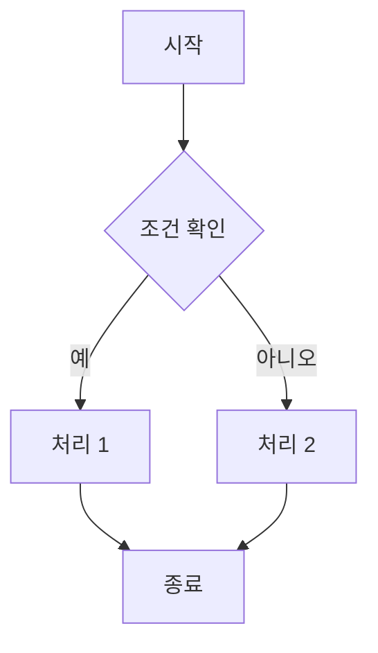
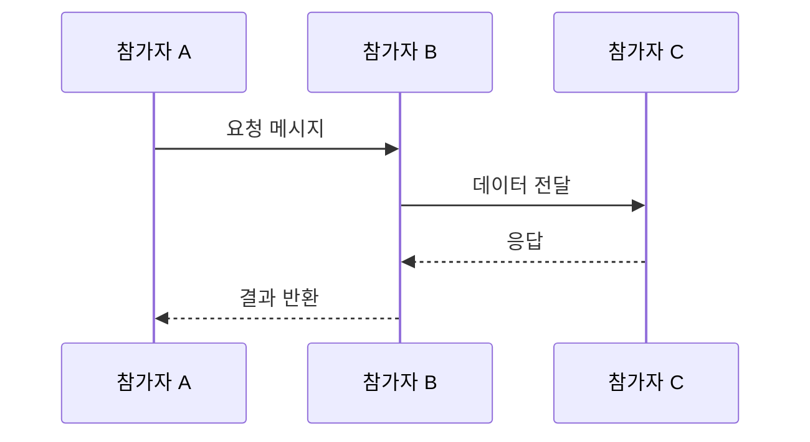
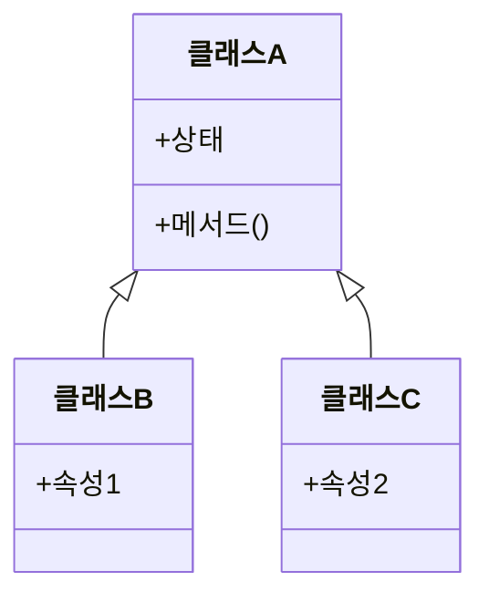

# Mermaid 다이어그램 테스트

아래는 Mermaid로 작성된 순서도 예시입니다:

```mermaid
graph TD
    A[시작] --> B{조건 확인}
    B -->|예| C[처리 1]
    B -->|아니오| D[처리 2]
    C --> E[종료]
    D --> E
```

아래는 시퀀스 다이어그램 예시입니다:

```mermaid
sequenceDiagram
    참가자 A->>참가자 B: 요청 메시지
    참가자 B->>참가자 C: 데이터 전달
    참가자 C-->>참가자 B: 응답
    참가자 B-->>참가자 A: 결과 반환
```

아래는 클래스 다이어그램 예시입니다:

```mermaid
classDiagram
    클래스 A <|-- 클래스 B
    클래스 A <|-- 클래스 C
    클래스 A : +상태
    클래스 A : +메서드()
    클래스 B : +속성1
    클래스 C : +속성2
```
